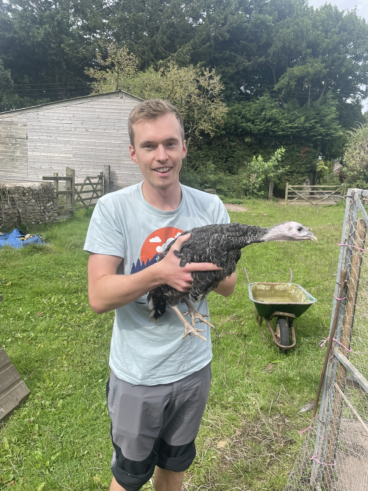

<!-- HERO -->
<section class="hero" style="background-image: linear-gradient(to bottom, rgba(0,0,0,.35), rgba(0,0,0,.55)), url('{{ page.hero_background }}');">
  

    
    <h1 class="hero-title">Hi, I’m Laurence.</h1>
    

        Crafting iOS apps with SwiftUI &amp; Flutter. 
        Sharing insights and stories from my indie dev journey.
    

    

      <a class="btn btn-primary" href="/apps/">See my apps</a>
      <a class="btn btn-ghost" href="/blog/">Read the blog</a>
      <a class="btn btn-ghost" href="/about/">About me</a>
    

  

</section>

<!-- LATEST APP -->
<section class="section latest-app-highlight" style="padding: 3.5rem 0; background: linear-gradient(90deg, #e0e7ff 0%, #f8fafc 100%); border-radius: 18px; box-shadow: 0 4px 24px rgba(60,60,120,0.08); margin-bottom: 2.5rem;">
  

    

      
    

    

      <h2 class="section-title" style="margin-top: 0; font-size: 2.2rem; letter-spacing: -1px; color: #2d3748;">Latest app: Earthquake Tracker & Monitor</h2>
      

        <strong>Earthquake Tracker & Monitor</strong> is built to visualise real-time earthquake data from the USGS (US Geological Survey) so you can stay safe. 
        Built with the latest Flutter features for a seamless, modern experience visualising data.
      

      

        <a class="btn btn-primary" href="/apps/geology-ai/">Learn more</a>
        <a class="btn btn-primary" style="background-color: #4f46e5; color: #fff; border: none; box-shadow: 0 2px 8px rgba(79,70,229,0.15);" href="https://apps.apple.com/az/app/earthquake-tracker-monitor/id6748315703" target="_blank" rel="noopener">App Store</a>    

    

  

</section>

<!-- FEATURED APPS -->
<section class="section featured-apps-highlight" style="padding: 3.5rem 0; background: linear-gradient(90deg, #f1f5f9 0%, #e0e7ff 100%); border-radius: 18px; box-shadow: 0 4px 24px rgba(60,60,120,0.08); margin-bottom: 2.5rem;">
  

    <h2 class="section-title" style="font-size: 2.2rem; letter-spacing: -1px; color: #2d3748; margin-bottom: 2.2rem;">Featured apps</h2>
    

      <!-- Cloud Point Card -->
      

        
        <h3 class="card-title" style="font-size: 1.35rem; color: #4f46e5; margin-bottom: 0.7rem;">Cloud Point – Cloud Identifier</h3>
        

          A unique community of climate researchers battling extreme weather. No knowledge needed!
        

        

          <a class="btn btn-sm btn-primary" href="/apps/cloud-point/">Learn more</a>
          <a class="btn btn-sm" style="background: #e0e7ff; color: #3730a3;" href="https://apps.apple.com/gb/app/cloud-point-cloud-identifier/id6480587789" target="_blank" rel="noopener">App Store</a>
        

      

      <!-- Geology AI Card -->
      

        
        <h3 class="card-title" style="font-size: 1.35rem; color: #4f46e5; margin-bottom: 0.7rem;">Geology AI</h3>
        

          The powerful toolkit for field Geologists, aiding understanding, interpretation & sketches!
        

        

          <a class="btn btn-sm btn-primary" href="/apps/geology-ai/">Learn more</a>
          <a class="btn btn-sm" style="background: #e0e7ff; color: #3730a3;" href="https://apps.apple.com/my/app/geology-ai/id6745966254" target="_blank" rel="noopener">App Store</a>
        

      

    

    
<a href="/apps/">Browse all apps →</a>

  

</section>

<!-- LATEST POSTS -->
<section class="section">
  <h2 class="section-title">Latest posts</h2>
  

    
    
      
      <article class="post-item">
        <h3><a href="{{ post.url }}">{{ post.title }}</a></h3>
        
{{ post.date | date: "%B %d, %Y" }}

        
{{ post.excerpt | strip_html | truncate: 140 }}

      </article>
      
      
<a href="/blog/">See all posts →</a>

    
      
No posts yet — coming soon.

    
  

</section>

<!-- MINI ABOUT -->
<section class="section about-highlight" style="padding: 3.5rem 0; background: linear-gradient(90deg, #e0e7ff 0%, #f8fafc 100%); border-radius: 18px; box-shadow: 0 4px 24px rgba(60,60,120,0.08); margin-bottom: 2.5rem;">
  

    <!-- Photo -->
    

      
    

    <!-- About Content -->
    

      <h2 class="section-title" style="margin-top: 0; font-size: 2.2rem; letter-spacing: -1px; color: #2d3748;">About me</h2>
      

        Hi, I’m Laurence — a passionate mobile developer based in the UK, while currently travelling the world. I design, build, and ship helpful consumer apps with a focus on delightful user experiences and clean, maintainable code. Though that isn't how I started out...
      

      

        My current work explores the power of <strong>SwiftUI</strong> for iOS, while I continue to improve my <strong>Flutter</strong> projects. I love experimenting with new frameworks, prototyping ideas, and am coming out of my shell with sharing what I learn.
      

      <ul style="list-style: disc inside; margin-bottom: 1.2em; color: #444; font-size: 1.08em;">
        <li>Indie dev journey: from solo projects to App Store launches</li>
        <li>Writing about product, thoughtful tech, and indie life</li>
        <li>Always learning, iterating, and connecting with the community</li>
      </ul>
      

        Let’s connect:
        <a href="mailto:cloud.point88@gmail.com" style="margin-left: 0.5em;">cloud.point88@gmail.com</a>
        &nbsp;·&nbsp;
        <a href="https://github.com/LanceWW0">GitHub</a>
        &nbsp;·&nbsp;
        <a href="https://twitter.com/solodevdude">Twitter</a>
        &nbsp;·&nbsp;
        <a href="/about/">More about me →</a>
      

    

  

</section>
