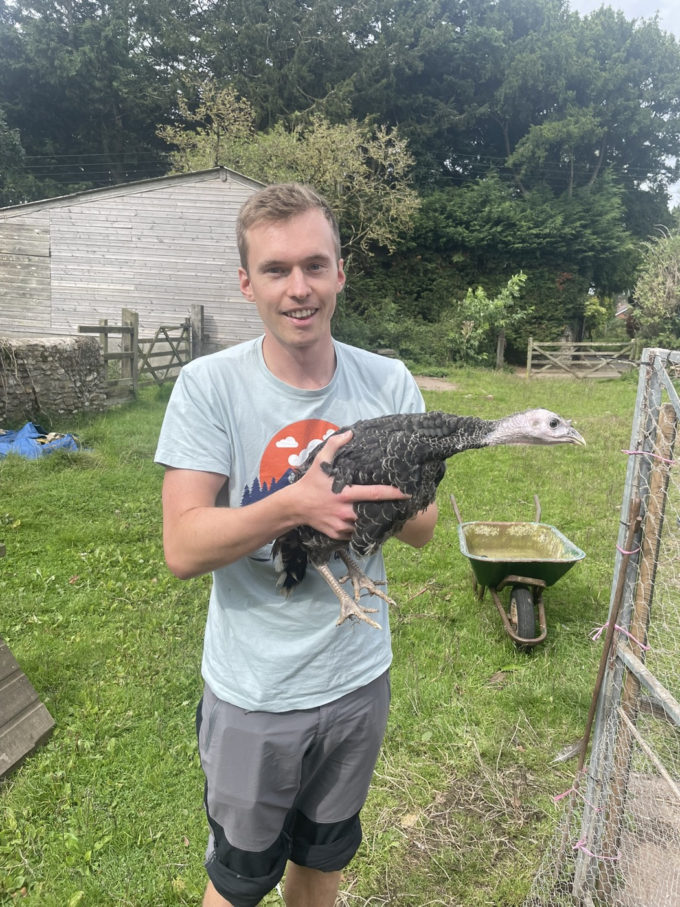

<!-- HERO -->
<section class="hero" style="background-image: linear-gradient(to bottom, rgba(0,0,0,.35), rgba(0,0,0,.55)), url('{{ page.hero_background }}');">
  

    
    <h1 class="hero-title">Hi, I’m Laurence.</h1>
    

        Crafting iOS apps with SwiftUI &amp; Flutter. 
        Sharing insights and stories from my solo development journey.
    

    

      <a class="btn btn-primary" href="/apps/">See my apps</a>
      <a class="btn btn-ghost" href="/blog/">Read the blog</a>
      <a class="btn btn-ghost" href="/about/">About me</a>
    

  

</section>

<!-- LATEST APP -->
<section class="section latest-app-highlight" style="padding: 3.5rem 0; background: linear-gradient(90deg, #e0e7ff 0%, #f8fafc 100%); border-radius: 18px; box-shadow: 0 4px 24px rgba(60,60,120,0.08); margin-bottom: 2.5rem;">
  

    

      
    

    

      <h2 class="section-title" style="margin-top: 0; font-size: 2.2rem; letter-spacing: -1px; color: #2d3748;">Latest app: Currency Converter – Valuto</h2>
      

        <strong>Valuto</strong> is a fast, minimal currency converter designed for travel. Instantly convert major currencies—even offline—with a clean interface and no ads or tracking. Valuto makes it easy to check exchange rates on the go, save your favourite currencies, and quickly switch between them. Whether you’re exploring a new country or shopping online, Valuto helps you stay on top of your spending with reliable, up-to-date rates and a distraction-free experience.    

      

        <a class="btn btn-primary" href="/apps/currency-converter/">Learn more</a>
        <a class="btn btn-primary" style="background-color: #4f46e5; color: #fff; border: none; box-shadow: 0 2px 8px rgba(79,70,229,0.15);" href="https://apps.apple.com/app/valuto-currency-converter/id0000000000" target="_blank" rel="noopener">App Store</a>
      

    

  

</section>

<!-- MAJOR UPDATE INCOMING -->
<section class="section major-update-highlight" style="padding: 3.5rem 0; background: linear-gradient(90deg, #fde68a 0%, #f8fafc 100%); border-radius: 18px; box-shadow: 0 4px 24px rgba(120,80,20,0.08); margin-bottom: 2.5rem;">
  

    

      
    

    

      <h2 class="section-title" style="margin-top: 0; font-size: 2.2rem; letter-spacing: -1px; color: #b45309;">Major update incoming: Earthquake Tracker & Monitor</h2>
      

        <strong>Earthquake Tracker & Monitor</strong> is about to get even better! A major update is on the way, bringing new features and improvements to help you visualise real-time earthquake data from the USGS (US Geological Survey) and stay safe wherever you are. 
        Built with the latest Flutter features for a seamless, modern experience understanding the data.
      

      

        <a class="btn btn-primary" href="/apps/earthquake-tracker/">Learn more</a>
        <a class="btn btn-primary" style="background-color: #b45309; color: #fff; border: none; box-shadow: 0 2px 8px rgba(180,83,9,0.15);" href="https://apps.apple.com/az/app/earthquake-tracker-monitor/id6748315703" target="_blank" rel="noopener">App Store</a>
      

    

  

</section>

<!-- FEATURED APPS -->
<section class="section featured-apps-highlight">
  

    <h2 class="section-title" style="margin-top: 0; font-size: 2.2rem; letter-spacing: -1px; color: #2d3748;">Featured Apps</h2>
    

      <!-- Cloud Point Card -->
      

        
        <h3 class="card-title">Cloud Point – Cloud Identifier</h3>
        

          A unique community created by and for cloud-spotters. No prior knowledge needed!
        

        

          <a class="btn btn-sm btn-primary" href="/apps/cloud-point/">Learn more</a>
          <a class="btn btn-sm btn-accent" href="https://apps.apple.com/gb/app/cloud-point-cloud-identifier/id6480587789" target="_blank" rel="noopener">App Store</a>
        

      

      <!-- Geology AI Card -->
      

        
        <h3 class="card-title">Geology Toolkit: AI Rock ID</h3>
        

          A powerful toolkit for field Geologists, aiding understanding, interpretation and sketches!
        

        

          <a class="btn btn-sm btn-primary" href="/apps/geology-ai/">Learn more</a>
          <a class="btn btn-sm btn-accent" href="https://apps.apple.com/my/app/geology-ai/id6745966254" target="_blank" rel="noopener">App Store</a>
        

      

    

    
<a href="/apps/">Browse all apps →</a>

  

</section>

<!-- LATEST POSTS -->
<section class="section">
  <h2 class="section-title">Latest posts</h2>
  

    <!-- Blog Tile 1 -->
    <a href="/blog/why-i-gave-up-on-android/" style="text-decoration: none;">
      

        <h3 style="margin: 0 0 0.75rem 0; font-size: 1.5rem; font-weight: 600; line-height: 1.3; letter-spacing: -0.5px; color: white;">Why I Finally Gave Up With Android</h3>
        
What drove me away from Android development — and why Apple just makes more sense for indie developers.

        
      

    </a>
    <!-- Blog Tile 2 -->
    <a href="/blog/escaping-the-app-trap/" style="text-decoration: none;">
      

        <h3 style="margin: 0 0 0.75rem 0; font-size: 1.5rem; font-weight: 600; line-height: 1.3; letter-spacing: -0.5px; color: white;">Escaping the App Trap</h3>
        
How I stopped chasing attention, rethought marketing, and found meaning in app development again.

      

    </a>
  

  
<a href="/blog/">See all posts →</a>

</section>

<!-- MINI ABOUT -->
<section class="section about-highlight" style="padding: 3.5rem 0; background: linear-gradient(90deg, #e0e7ff 0%, #f8fafc 100%); border-radius: 18px; box-shadow: 0 4px 24px rgba(60,60,120,0.08); margin-bottom: 2.5rem;">
  

    <!-- Photo -->
    

      
    

    <!-- About Content -->
    

      <h2 class="section-title" style="margin-top: 0; font-size: 2.2rem; letter-spacing: -1px; color: #2d3748;">About me</h2>
      

        Hi, I’m Laurence — a passionate mobile developer based in the UK, while currently travelling the world. Although I started out in cyber security, I now design, build, and ship helpful consumer apps with a focus on positive user experiences and clean, efficient code.
      

      

        My current work explores the power of <strong>SwiftUI</strong> for iOS, while I continue to improve my <strong>Flutter</strong> projects. I love experimenting with new frameworks, prototyping ideas, and sharing the lessons I've learned along the way with others.
      

      

        Find out more about me and my indie development journey here.
      

      

        Let’s connect:
        <a href="mailto:hello@laurence-wayne.com" style="margin-left: 0.5em;">hello@laurence-wayne.com</a>
        &nbsp;·&nbsp;
        <a href="https://github.com/LanceWW0">GitHub</a>
        &nbsp;·&nbsp;
        <a href="https://twitter.com/solodevdude">Twitter</a>
        &nbsp;·&nbsp;
        <a href="/about/">More about me →</a>
      

    

  

</section>
